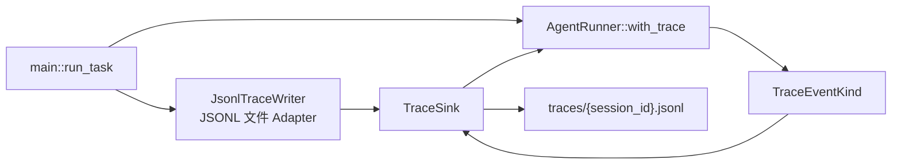
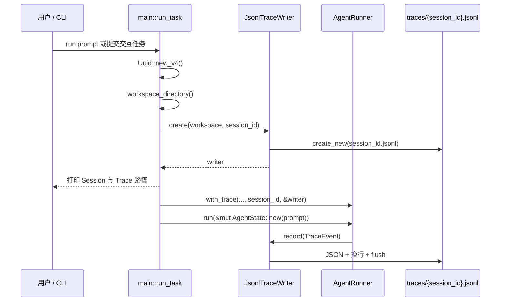
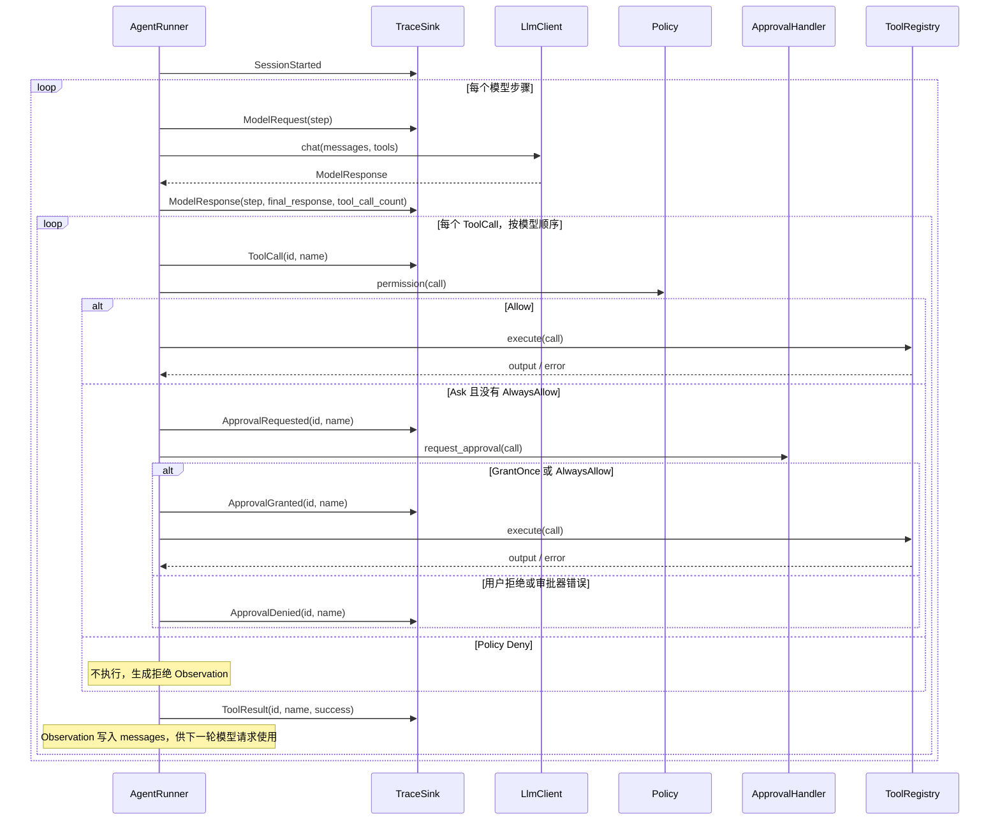

# V5 Trace 如何嵌入 Agent

本文专门说明 V5 如何把结构化 Trace 嵌入 Agent 运行循环：Trace 在何处创建、如何注入 `AgentRunner`、哪些时机记录事件、记录失败如何影响任务，以及如何避免 Trace 自身泄露或被模型工具篡改。

相关实现：

```text
src/main.rs          # 每个任务创建 Trace Writer，并注入 Runner
src/agent/runner.rs  # Agent 运行路径中的 TraceEvent 发射点
src/trace.rs         # 事件模型、TraceSink、JSONL Writer、路径与脱敏
src/tools/tool.rs    # 将 traces/ 作为模型不可访问的敏感路径
src/tools/write_file.rs # 阻止 write_file 修改 traces/ 子树
```

## 设计定位：Observer Port，而不是 Runner 的文件系统职责

V5 没有让 `AgentRunner` 直接打开或写入 JSONL 文件。它只依赖一个观察者接口：

```rust
pub trait TraceSink: Send + Sync {
    fn record(&self, event: &TraceEvent) -> Result<()>;
}
```

`AgentRunner` 持有 `&dyn TraceSink`，并在生命周期中的关键点调用 `record`。它不知道事件最终被写到哪里：生产环境使用 `JsonlTraceWriter` 写入文件，测试可以注入内存记录器。



这种设计的结果：

- **解耦**：Runner 专注于 Agent 逻辑，不依赖文件系统 API；
- **可替换**：可实现内存、网络或指标系统的 `TraceSink`；
- **可测试**：测试通过 `RecordingSink` 断言事件顺序，无需读取磁盘文件；
- **显式启用**：生产 Runner 必须通过 `with_trace` 接收 session 与 sink，不存在静默的“关闭 Trace”路径。

`NullTraceSink` 只在 `#[cfg(test)]` 下存在，用于保留不关心审计事件的单元测试组合；它不是生产配置项。

## 从 CLI 到 AgentRunner 的注入链路

V5 每执行一次 `run <prompt>`，或交互模式每接收一条有效任务，都会调用 `run_task`。该函数负责一个 Trace Session 的完整生命周期：



核心装配代码等价于：

```rust
let session_id = Uuid::new_v4();
let workspace = workspace_directory()?;
let writer = JsonlTraceWriter::create(&workspace, session_id)?;

let runner = AgentRunner::with_trace(
    client, registry, model, policy, approver, session_id, &writer,
);
let mut state = AgentState::new(prompt);
runner.run(&mut state).await?;
```

每个任务生成新的 UUID、新的 Writer 和新的 JSONL 文件。因此交互模式中连续提交两条任务，会生成两个互不混用的 Trace Session。查看历史记录可以运行：

```bash
cargo run -p mini-harness-v5 -- trace <canonical-uuid>
```

`trace` 子命令在创建 LLM Client 之前执行，因此只查看已有 Trace 时不要求 OpenAI 环境变量。

## Trace 数据模型

每条 Trace 都是独立的 JSON Object，写入 `traces/{session_id}.jsonl`。公共字段为：

```json
{
  "timestamp": "2026-01-01T00:00:00Z",
  "session_id": "550e8400-e29b-41d4-a716-446655440000",
  "type": "tool_result"
}
```

事件类型 `TraceEventKind` 包含：

| 事件 | 关键字段 | 说明 |
|---|---|---|
| `session_started` | — | 任务的运行循环开始。 |
| `model_request` | `step` | 即将调用模型。 |
| `model_response` | `step`、`final_response`、`tool_call_count` | 已解析模型响应的结构摘要。 |
| `tool_call` | `id`、`name` | Runner 即将对该调用执行策略判断。 |
| `approval_requested` | `id`、`name` | Policy 为 `Ask`，正在请求人工批准。 |
| `approval_granted` / `approval_denied` | `id`、`name` | 审批结果。 |
| `tool_result` | `id`、`name`、`success` | 工具执行或拒绝的最终结果。 |
| `agent_completed` | `step` | 模型已输出最终答复。 |
| `agent_failed` | `step`、`error` | 不可恢复的 Agent / Trace 失败。 |
| `max_steps_reached` | `step` | 已达到模型请求次数上限。 |

事件模型刻意**不包含**以下内容：

- 用户 Prompt；
- 完整 messages 或模型文本；
- 模型请求体、工具 schema；
- 工具 arguments；
- 工具 output。

因此 Trace 用于重建“发生了什么、顺序是什么、调用了哪个工具、是否成功”，而不用于重放全部私有上下文或持久化工具 payload。

## Runner 内部的发射机制

`AgentRunner::with_trace` 保存 `session_id` 与 `trace`：

```rust
session_id: Uuid,
trace: &'a dyn TraceSink,
```

所有事件都经过统一的 `emit`：

```rust
fn emit(&self, kind: TraceEventKind) -> Result<()> {
    self.trace.record(&TraceEvent::new(self.session_id, kind))
}
```

这保证每个 Runner 发出的事件使用同一个 session ID，并由 `TraceEvent::new` 添加 UTC 时间戳。

### 正常最终答复的顺序

当模型直接返回非空文本、没有工具调用时，事件顺序固定为：

```text
SessionStarted
→ ModelRequest { step: 1 }
→ ModelResponse { step: 1, final_response: true, tool_call_count: 0 }
→ AgentCompleted { step: 1 }
```

`AgentCompleted` 在最终文本通过非空校验、写入 `AgentState.messages` 且状态设为 `Completed` 后发射。

### 含工具调用的顺序

当模型返回一个或多个 `ToolCall`，Runner 先记录完整的 assistant tool-call message，再按模型返回顺序串行处理每一个调用。



关键时序约束：

1. `ToolCall` 在 Policy 判断之前发射；Trace 不记录其 arguments。
2. `ApprovalRequested` 只出现在 `Ask` 且当前任务尚未对同名工具设置 AlwaysAllow 的情况。
3. `Allow`、已 AlwaysAllow 的 `Ask` 不产生新的审批事件。
4. Policy `Deny` 不产生审批事件，也不会调用 `ToolRegistry`，但仍产生 `ToolResult { success: false }`。
5. 用户拒绝、审批器错误、工具返回 `success: false` 和工具返回 `Err` 都产生 `ToolResult { success: false }`，并把失败信息作为可恢复 Observation 回传模型。
6. 完成所有工具调用后，才发起下一轮 `ModelRequest`。

## 可恢复失败与终态失败

Trace 将“模型可根据 Observation 调整的失败”和“任务不可继续的失败”区分开来。

| 情况 | Trace 结果 | Agent 是否继续 |
|---|---|---|
| Policy `Deny` | `ToolResult(success: false)` | 继续，模型收到拒绝 Observation。 |
| 用户拒绝审批 | `ApprovalDenied` + `ToolResult(success: false)` | 继续。 |
| 审批器不可用 | `ApprovalDenied` + `ToolResult(success: false)` | 继续。 |
| 工具返回失败或 `Err` | `ToolResult(success: false)` | 继续。 |
| LLM 网络/API/协议错误 | `AgentFailed` | 终止并返回 `Err`。 |
| 最终答复为空 | `AgentFailed` | 终止并返回 `Err`。 |
| 普通 Trace 事件写入失败 | 尝试 `AgentFailed` | 终止并返回原始写入错误。 |
| 达到 `max_steps` | `MaxStepsReached` | 正常返回 `MaxStepsReached`。 |

除 `fail` 中的最后一条 `AgentFailed` 外，任何 `emit` 失败都会进入 `fail` 路径。`fail` 会把 Agent 状态设为 `Failed`，并尽力追加：

```text
AgentFailed { step, error: safe_error(...) }
```

最后一条失败事件采用 best-effort：即使 Trace Writer 已无法继续写入，也不会掩盖最初触发失败的错误。因此不保证每个失败 Session 的文件都一定以 `agent_failed` 收尾。

## JsonlTraceWriter：落盘、隔离与读取

`JsonlTraceWriter` 是 `TraceSink` 的文件系统适配器。它绑定一个 `session_id`、一个文件路径和受 `Mutex` 保护的 `BufWriter<File>`。

创建过程：

1. canonicalize workspace，且必须是目录；
2. 确认直接子目录 `traces/` 存在，或由 Writer 创建；
3. 拒绝 `traces/` 是符号链接或非目录；
4. canonicalize 后确认 `traces/` 的父目录就是 canonical workspace；
5. 使用内部生成的 UUID 创建 `traces/{uuid}.jsonl`；
6. 以 `create_new(true)` 原子创建，拒绝覆盖既有 Session 文件。

每次 `record`：

```text
TraceEvent → serde_json → 追加换行 → Mutex 加锁 → write_all → flush
```

每一行都是完整 JSON，且每个事件后立即 `flush`。这使已写入的事件能尽快可见，但不等同于对物理介质执行 `sync_all`。

读取 `trace <session-id>` 时：

- session ID 必须是 canonical 连字符 UUID，避免路径拼接或 traversal；
- 目标文件会 canonicalize；
- canonical 文件的直接父目录必须仍是 canonical `traces/`；
- 读取后逐行拒绝空行与无效 JSON。

因此符号链接目录、指向工作区外的 trace 文件和非法 session ID 都会被拒绝。

## 隐私与 Trace 自身保护

Trace 的保护分为三层。

### 1. Schema 最小化

工具事件只记录 `id`、`name` 和 `success`。不持久化工具参数、输出、prompt 或模型回复，因此常见凭据不会因为正常工具调用进入 Trace。

### 2. Fatal error 脱敏

`AgentFailed.error` 是唯一可能保存文本诊断的字段。`safe_error` 会逐行识别包含下列标识的错误文本并替换整行：

```text
api_key, apikey, authorization, bearer, password, secret,
access_token, refresh_token
```

错误文本还会限制为 2,048 个字符。该机制是启发式脱敏，不是通用秘密检测；不包含这些标识的敏感值仍可能出现在 fatal error 中，因此不应将 Trace 视为绝对无敏感数据的存储。

### 3. 保护 `traces/` 子树不被模型工具访问

`traces` 被定义为敏感 workspace 路径：`read_file` 和 `list_files` 无法读取或暴露它。`main` 创建 `WriteFileTool` 时还调用：

```rust
WriteFileTool::new(&workspace)?.with_reserved_subtree("traces")?
```

因此即使用户审批通过，模型也不能通过 `write_file` 修改 `traces/*.jsonl`。加上 Trace Writer 自己的 canonical 路径检查，共同保护当前和历史审计记录。

## 测试方式

Runner 的事件顺序测试通过自定义 `RecordingSink` 收集 `TraceEventKind`，验证：

- 纯最终答复的固定事件顺序；
- 审批、工具调用、下一轮模型请求的顺序；
- 拒绝和工具失败都写为 `ToolResult(success: false)`；
- 超过步数与 fatal error 的终态事件。

`trace.rs` 还测试 JSONL 每行可解析、fatal error 脱敏、UUID 格式校验、拒绝 trace 文件和目录的符号链接逃逸。`WriteFileTool` 测试确认 `traces/` 保留子树不能被替换。

## 小结

V5 通过“**组合根创建 Writer → Runner 注入 TraceSink → 关键状态转换 emit 结构化事件 → JSONL Adapter 逐事件 flush**”把 Trace 嵌入 Agent。

Trace 观察完整控制流，而不复制模型上下文或工具 payload；Trace 写入默认是影响任务正确性的审计步骤，而不是静默忽略的 telemetry。与此同时，最小化事件 Schema、fatal error 脱敏、受限路径解析和工具层 `traces/` 保留规则，共同降低 Trace 记录与保存本身带来的敏感数据和篡改风险。
