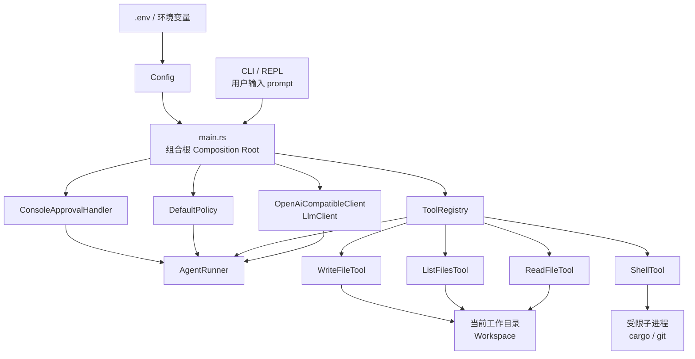
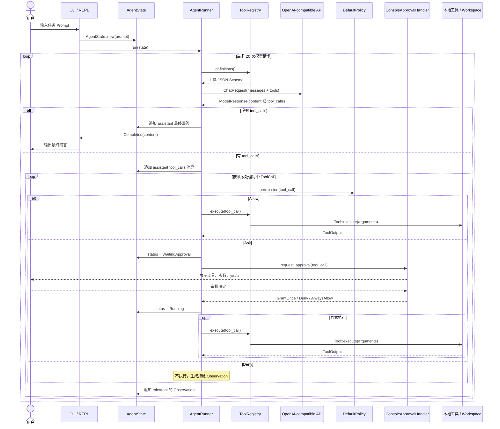
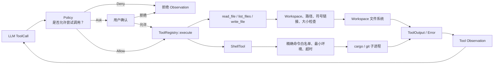

# mini-harness V4 架构与数据流

本文整理 `mini-harness` V4 的模块职责、运行时组合关系、Agent 循环、策略审批和本地工具安全边界。V4 是一个单进程、Tokio 驱动的受策略约束 Coding Agent：模型可以调用有限的本地工具，但每次调用都必须经过 Policy、可选的用户审批，以及工具自身的原生限制。

## 架构总览

V4 的依赖由 `src/main.rs` 在启动时组合：

```text
main
├── Config                 从 .env / 环境变量读取模型配置
├── OpenAiCompatibleClient 调用 OpenAI-compatible Chat Completions API
├── ToolRegistry           注册本地工具
├── DefaultPolicy          决定 Allow / Ask / Deny
├── ConsoleApprovalHandler 在终端请求人工确认
└── AgentRunner            驱动模型、工具和 Observation 循环
```



`AgentRunner` 依赖的是抽象接口而非全局状态：

```rust
client: &'a dyn LlmClient,
policy: &'a dyn Policy,
approver: &'a dyn ApprovalHandler,
tools: &'a ToolRegistry,
```

因此未来可以替换模型供应商、策略、审批界面或工具实现，而无需改动 Agent 循环本身。

## 模块职责

| 模块 | 职责 |
|---|---|
| `main.rs` | 命令行入口，创建所有依赖；支持 `run <prompt>` 与交互式 REPL。 |
| `config/` | 从环境变量与 `.env` 加载 `OPENAI_API_KEY`、`OPENAI_BASE_URL`、`OPENAI_MODEL` 等配置。 |
| `llm/` | 定义异步 `LlmClient` 接口，并实现 OpenAI-compatible HTTP Client、消息与工具调用协议。 |
| `agent/state.rs` | 维护当前任务的消息记录、模型请求步数和任务状态。 |
| `agent/runner.rs` | 核心状态机：请求模型、处理 ToolCall、执行 Policy/Approval、回传 Observation。 |
| `policy/` | 产生 `Allow`、`Ask`、`Deny` 决策；在 Ask 时处理终端用户审批。 |
| `tools/` | 定义 `Tool` trait、注册表，以及文件读取、目录列举、文件写入与受限 Shell 工具。 |

## 运行时数据流

每个用户任务都会创建一个新的 `AgentState`。Runner 最多发起 20 次模型请求；该上限限制的是模型请求数，不限制单个模型响应中携带的工具调用数量。



工具输出、工具失败、Policy 拒绝和用户拒绝都不是 Runner 的 fatal error。它们会以和原始 `tool_call_id` 对应的 `role: tool` 消息写回 `AgentState.messages`，并在下一轮请求中发送给模型，让模型据此调整计划。只有 LLM 请求或协议处理失败会使状态变为 `Failed`。

## Agent 状态机

```mermaid
stateDiagram-v2
    [*] --> Running: AgentRunner::run()

    Running --> WaitingApproval: Policy = Ask
    WaitingApproval --> Running: 审批完成

    Running --> Running: Allow 或获批后执行工具\n结果写回 messages
    Running --> Running: Policy Deny\n拒绝信息写回 messages

    Running --> Completed: 无 tool_calls 且有最终文本
    Running --> MaxStepsReached: 达到 max_steps = 20
    Running --> Failed: LLM 请求或协议错误

    Completed --> [*]
    MaxStepsReached --> [*]
    Failed --> [*]
```

多工具调用在同一轮中按模型返回的顺序串行执行；V4 不实现并发工具调度、跨任务持久化状态或可恢复 Session。

## Policy 与审批

`Policy` 是工具执行前的强制决策点：

```text
ToolCall → Allow（直接执行） / Ask（审批后执行） / Deny（不执行）
```

默认规则如下：

| 调用 | 决策 | 说明 |
|---|---|---|
| `read_file`、`list_files` | `Allow` | 低风险只读操作。 |
| `write_file` | `Ask` | 写入前要求用户确认。 |
| `shell: cargo test`、`cargo check`、`git diff` | `Allow` | 可直接执行的检查命令。 |
| `shell: cargo fmt`、`cargo clippy`、`git status` | `Ask` | 需要用户确认。 |
| 未知工具、畸形参数、危险命令 | `Deny` | 默认拒绝，不能由用户覆盖。 |

危险 Shell 命令包括 `sudo`、`rm`、`dd`、`shutdown`、`reboot` 等；带管道、重定向、`&&` 等 shell 控制符，或下载并交给 `sh` / `bash` / `zsh` 执行的命令，也会被直接拒绝。

`ConsoleApprovalHandler` 会显示工具与经过脱敏的参数，并接受：

```text
y / yes     本次允许
n / no      拒绝
a / always  当前任务中始终允许该工具
```

`AlwaysAllow` 只保存当前任务内的工具名；新的 `run` 命令或下一轮 REPL 任务会重新创建审批状态。每次调用仍会先执行 Policy 判断，因此 `Deny` 的优先级高于之前的 always allow。读取 stdin 遇到 EOF 或审批器出错时，调用会安全地被拒绝。参数中的 `api_key`、`token`、`password`、`secret` 等常见敏感键会显示为 `[REDACTED]`。

## 工具与安全边界



| 工具 | 能力 | 主要安全约束 |
|---|---|---|
| `read_file` | 读取 UTF-8 普通文件 | 仅限 workspace；拒绝路径穿越、符号链接逃逸与敏感文件；最大 1 MiB。 |
| `list_files` | 列出目录的直接子项 | 不递归；最多 1,000 项；隐藏 `.env`、私钥和凭据目录等敏感项。 |
| `write_file` | 原子写入文件 | 默认要求审批；仅限 workspace；检查父目录、目标类型和符号链接；最大 1 MiB。 |
| `shell` | 执行开发命令 | 不启动 shell；只接受精确白名单命令；清理子进程环境；120 秒超时。 |

`ShellTool` 的实际命令白名单是：

```text
cargo check
cargo test
cargo fmt
cargo clippy
git diff
git status
```

这构成第二道防线：即使 Policy 对某个普通命令返回 `Ask` 并且用户批准，底层 ShellTool 也不会执行任何不在精确白名单中的命令。审批允许的是“尝试调用该工具”，不是扩大工具原生能力。

## 典型任务流程

以“修复编译错误，然后运行测试”为例：

```text
1. 用户提交 Prompt。
2. 模型调用 read_file；Policy Allow；读取结果回传模型。
3. 模型调用 write_file；Policy Ask；用户输入 y；文件被安全写入。
4. 模型调用 shell("cargo check")；Policy Allow；检查输出回传模型。
5. 模型调用 shell("cargo test")；Policy Allow；测试输出回传模型。
6. 模型基于全部 Observation 返回最终说明。
```

## 设计结论

V4 的安全模型由三层组成：

1. **AgentRunner / Policy**：模型是否能尝试某次工具调用。
2. **ApprovalHandler**：对 `Ask` 类操作由用户进行任务内确认。
3. **Native Tool**：路径、参数、命令、I/O、环境与超时等实际能力限制。

因此，V4 不是任意权限的自动化脚本执行器，而是一个将模型决策限制在受控 workspace、受限工具集和可审查用户授权范围内的 Coding Agent。
